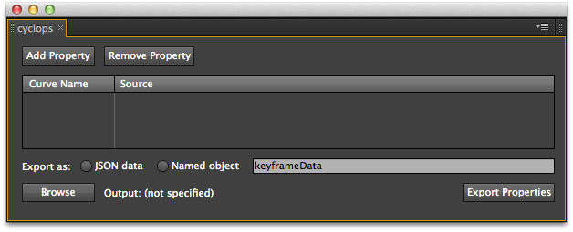
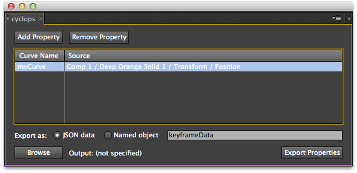

# After Effects Plugin

To create motion data for use with Cyclops, you'll need to install the After Effects Cyclops script panel. For more extensive instructions please take a look at [this Adobe Support page](http://helpx.adobe.com/en/after-effects/using/scripts.html), otherwise you can use the summarized instructions listed below.

## Install the Script

Copy `cyclops.jsx` folder into the `ScriptUI Panels` folder for After Effects.  By default, you can find the `ScriptUI Panels` folder in the following location:

##### Windows
`Program Files\Adobe\Adobe After Effects <version>\Support Files\Scripts\ScriptUI Panels`

##### Mac OS
`Applications/Adobe After Effects <version>/Scripts/ScriptUI Panels`

**Note:** The `ScriptUI Panels` folder may or may not exist, if it doesn't exist you can simply create the folder yourself.

## Allow Scripts to Write Files

By default, After Effects does not allow scripts to create files on your hard drive.  In order for Cyclops to save motion data into a file, this setting must be changed in the After Effects preferences.

To change this setting, open the **General** panel in the After Effects Preferences and make sure there is a check mark next to the option titled "Allow Scripts to Write Files and Access Network"

## Run the Script

After you have copied the script and updated the preferences, restart After Effects.  To launch the Cyclops panel open the `Window` menu and select `cyclops.jsx` from the list.  This will display the Cyclops window which you can leave as a free floating window or dock with into the After Effects UI.

## Select a Property for Export

Once you have created some motion for an element in your composition, highlight one of the transform properties and click the `Add Property` button in the cyclops UI panel.

Next click **Add Property** in the Cyclops panel and you will be prompted to name the curve for the selected property.  By default the curve name will be the layer name and property name joined with a hyphen.  It's recommended that you choose a short but descriptive curve name that reflects the intended use of the curve.

After you choose a curve name, a new row will appear in the Cyclops panel listing the name and source of the curve.

**If you change the name of a layer or object that is currently set to have any of its properties exported you will need to remove and re-add the property in the Cyclops Panel**

## Set Export Options

#### Export as JSON

The curve data can be stored in one of two ways, the first is as what's known as JSON data.  This is a sort of "raw" way of storing data and must be incorporated into your project through some sort of build process, or loaded asynchronously, copied/pasted into another JavaScript file, etc.  In other words, exporting JSON means you still have some work to do to get your project building.  However, it is more flexible for use with tools like Grunt as it is a more pure way to store the curve data.

#### Export as Named object

This option will create a JavaScript file that can be directly included in an existing HTML page.  It is similar to the JSON export option but it includes some extra syntax that results in fully-formed JavaScript code rather than raw data.  The input field is used to specify the variable name that will be used to store the curve data.   

For instance, if you use `myAwesomeCurve` as the name, the resulting exported file would look like this:

	var myAwesomeCurve = { ... all the json data ... };

#### Choose an Output File

You can set Cyclops to put the curve data anywhere you'd like, just click the **Browse** button to select a folder and file name.  Once set, this file will be overwritten every time you click **Export Properties**.

## Export Data

Once you have added at least one property to the list and set your export options, you are ready to export the curve data.

Click `Export Properties` to create a JavaScript file from the motion data.  This JavaScript file will be used to reproduce the motion in the browser.  If you aren't a developer, you will need to work with whomever is writing the code for your project, it's important that you coordinate closely with them (especially when setting up the project initially).

The Cyclops script will save your export settings when the After Effects project is saved, so you will only need to configure the list of properties once and they will be there any time you open the project.

Once your composition and code are set up to use this motion data you will be able to make changes in After Effects and simply overwrite the old curve data without changing any code.